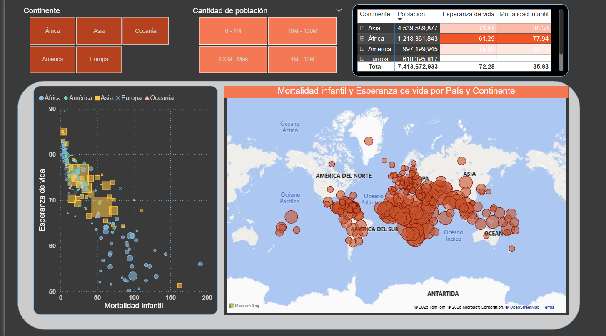
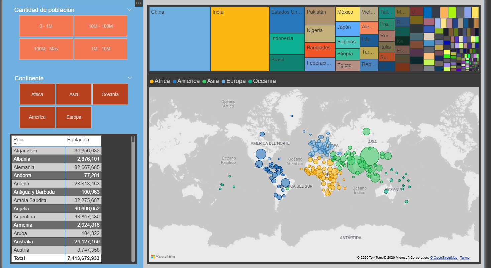
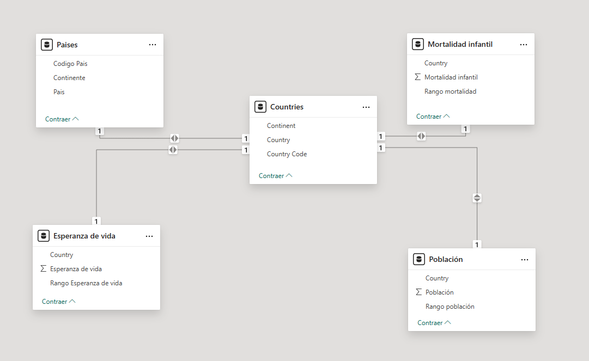

# 🌍 Population, Life Expectancy & Infant Mortality Analysis

Interactive Power BI dashboard designed to analyze global demographic and health indicators through comparative and geographic analysis.

---

## 📌 Project Overview

This project combines multiple datasets using relational modeling to explore worldwide population distribution, life expectancy, and infant mortality patterns across countries and continents.

The dashboards allow interactive exploration of demographic and public health indicators through maps, scatterplots, treemaps, and dynamic slicers.

---

## 🛠 Tools & Technologies

- Power BI
- Power Query
- Data Modeling
- Relational Modeling
- Data Visualization
- Interactive Reporting

---

## 📊 Analytical Questions Explored

- How does infant mortality relate to life expectancy?
- Which continents concentrate the largest populations?
- What regional disparities exist in global health indicators?
- How do demographic patterns vary geographically?

---

## 📈 Dashboard Features

- Interactive slicers by:
  - Continent
  - Population range
- Geographic population analysis
- Scatterplot analysis of health indicators
- Treemap visualization by country
- Interactive global maps
- Relational data model across multiple tables

---

## 🔍 Key Insight

Countries with higher infant mortality rates generally tend to present lower life expectancy levels, highlighting significant global health disparities across regions.

---

## 🖼 Dashboard Preview

### Health Analysis Dashboard

---

### Population Dashboard

---

## 🔄 Data Model

---

## 🎯 Key Skills Demonstrated

- Data modeling
- Relational analysis
- Geographic visualization
- Interactive dashboard design
- Comparative analytics
- Data storytelling

---

## 🔗 Portfolio

- Notion Portfolio: https://www.notion.so/Population-Life-Expectancy-Infant-Mortality-Analysis-35dddeb9784680ac89fff5ac57169e72?source=copy_link
  
